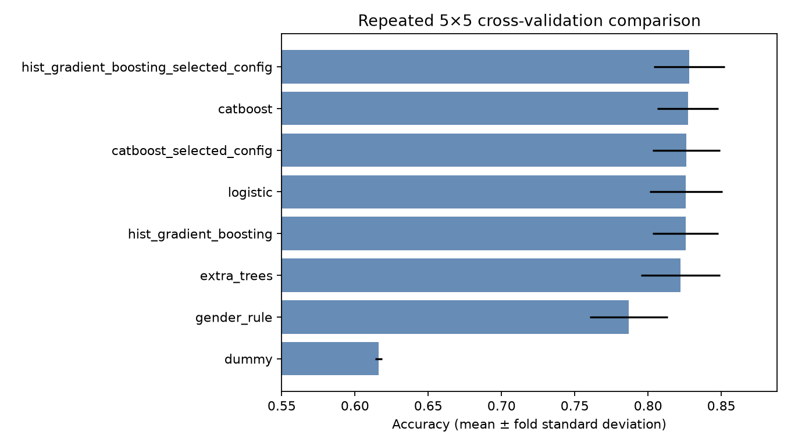
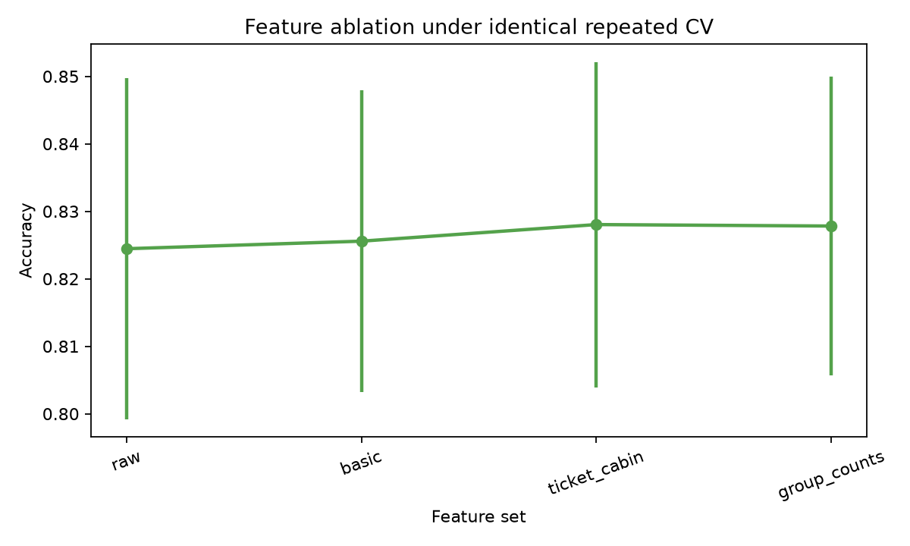

# Titanic Survival Prediction

Official passenger-manifest data is transformed through leakage-safe feature
engineering and model comparison into a binary survival prediction.

## The problem

Titanic is a historical binary-classification benchmark. For technical
recruiters and data practitioners, it is a compact setting for evaluating
tabular data quality, missing-value strategy, validation discipline, model
selection, reproducibility, and honest communication. It is not a contemporary
maritime-safety or life-critical application.

## What the system does

```text
Passenger manifest data
        ->
feature engineering and leakage-safe model comparison
        ->
binary survival prediction with interpretable evidence
```

The input is official passenger-manifest data; the transformation is an
audited, fold-safe modeling pipeline; the output is a validated
`PassengerId,Survived` CSV. The demonstrated value is rigorous tabular
machine-learning judgment in a small, reviewable project.

## Example input and output

This schema-level example is synthetic and does not imply a hidden test label:

```text
Input:  Pclass=2, Sex=female, Age=31, SibSp=1, Parch=0,
        Fare=26.0, Embarked=S, Name=<synthetic>, Ticket=<synthetic>
Output: PassengerId=<official test ID>, Survived=<0 or 1>
```

## Key result

The locked model is `HistGradientBoostingClassifier` with the **basic** feature
set and an out-of-fold-selected threshold of **0.575**.

| Evidence | Accuracy |
|---|---:|
| Repeated stratified CV (5 folds × 5 repeats) | **0.8323 ± 0.0231** |
| Second seed (5 folds × 2 repeats) | **0.8249 ± 0.0302** |
| Family-group stress test | **0.8204 ± 0.0286** |
| Ticket-group stress test | **0.8282 ± 0.0250** |
| Kaggle public score (submission 54982397) | **0.77033** |
| Sex-only rule | 0.7867 ± 0.0267 |
| Logistic regression | 0.8258 ± 0.0248 |

The thresholded averaged out-of-fold predictions produced `TN=514`, `FP=35`,
`FN=121`, and `TP=221`. A two-model soft vote was rejected: it was
0.0018 below the best single model on repeat-level mean accuracy and improved
only 2 of 5 repeats, short of the predeclared qualification rule.

Local repeated CV estimates generalization across training folds; family/ticket
diagnostics stress dependence between related passengers. The Kaggle public
score is a separate measurement on hidden competition labels and was recorded
only after the configuration was locked. It was not used to select or retune
the model.

## Kaggle submission

The single qualified file, `hist_gradient_boosting_selected.csv`, completed
successfully under Kaggle submission reference **54982397** with public score
**0.77033**. The transparent baseline was generated only for local schema
validation, and the rejected ensemble was neither generated nor uploaded.
Prediction CSVs remain ignored; the tracked
[submission log](reports/submission_log.csv) contains only metadata and scores.



## What was tested

- Official Kaggle files only: 891 labeled rows and 418 unlabeled rows.
- Transparent baselines, logistic regression, ExtraTrees,
  HistGradientBoosting, and CatBoost.
- One shared `RepeatedStratifiedKFold(5 × 5)` split design for fair comparison.
- Separate family- and ticket-group stress tests for dependence between
  travelling companions.
- Four cumulative feature sets, including fold-fitted group counts.
- A bounded randomized search: 12 configurations × 5 folds for each of two
  finalists (120 fits total).
- Threshold selection from training out-of-fold probabilities only.
- A five-point soft-voting weight grid, accepted only if it materially and
  consistently improved the best single model.

The best ablation mean was the 22-feature ticket/cabin set at 0.8280, but its
0.0025 gain over raw fields was within the practical-tie margin. The simpler
18-feature basic set was retained after threshold analysis. Fold-fitted group
counts did not improve the preceding set and weakened both group stress tests.



## Reproduce locally

Python 3.12 is required. From the repository root:

```powershell
py -3.12 -m venv .venv
.\.venv\Scripts\python.exe -m pip install -e ".[dev]"
.\.venv\Scripts\kaggle.exe auth login
.\.venv\Scripts\kaggle.exe competitions download titanic -p data\raw
Expand-Archive data\raw\titanic.zip -DestinationPath data\raw
$env:MPLCONFIGDIR = (Join-Path (Get-Location) ".matplotlib")
$env:LOKY_MAX_CPU_COUNT = "4"
.\.venv\Scripts\python.exe -m titanic_survival_prediction.experiment `
  --data-dir data\raw --output-dir reports --submissions-dir submissions `
  --random-seed 20260725 --generate-submissions
```

Kaggle credentials remain outside the repository. Raw data, the virtual
environment, caches, model binaries, and prediction CSVs are ignored. Aggregate
metrics, hashes, figures, and the submission log are tracked.

## Review the evidence

- [Data audit notebook](notebooks/01_data_audit.ipynb)
- [Model experiments notebook](notebooks/02_model_experiments.ipynb)
- [Machine-readable final selection](reports/metrics/final_model_selection.json)
- [Full aggregate project summary](reports/metrics/final_project_summary.json)
- [Submission log](reports/submission_log.csv)
- [Executed project record](PROJECT_PLAN.md)

The compact repository contains reusable code under `src/`, 26 synthetic tests
under `tests/`, exactly two executed notebooks, aggregate evidence under
`reports/`, one lightweight GitHub Actions workflow, and project documentation.
Raw data and generated prediction files stay local and ignored.

Run the quality checks with:

```powershell
.\.venv\Scripts\ruff.exe check .
.\.venv\Scripts\pytest.exe
.\.venv\Scripts\python.exe -m titanic_survival_prediction.validation `
  --notebooks --require-executed
```

## Integrity and limitations

No external data, copied predictions, reconstructed labels, target-derived
family/ticket priors, train/test-combined feature counts, or leaderboard
feedback was used for model selection. All learned preprocessing and
dataset-level counts are fitted inside training folds. The Kaggle test set is
used only after the strategy is locked.

This is a small, historical, heavily studied benchmark with missing values,
related passengers, and social categories from 1912. Cross-validation variance
is meaningful; accuracy hides asymmetric errors; subgroup results are
descriptive; and permutation importance measures predictive association, not
causality. The model is not suitable for real-world maritime or life-critical
decisions.

Licensed under the [MIT License](LICENSE).
